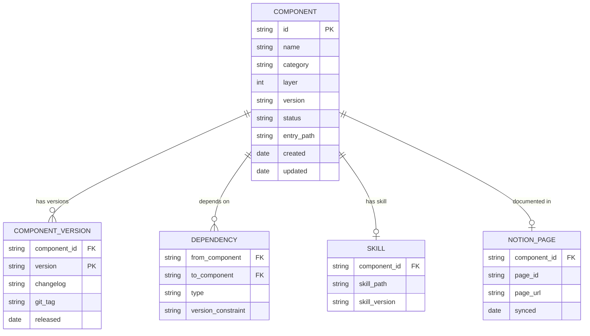
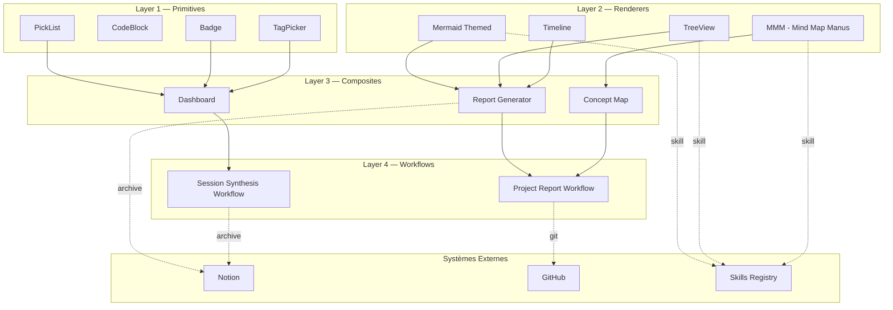

# yOS Components Registry — Architecture Document

**Version** : 1.0.0-draft  
**Date** : 2026-03-04  
**Auteur** : Manus (Architecte Cognitif)  
**Statut** : Proposition — Décision requise sur Git Strategy (§6)

---

## Table des Matières

1. [Vision & Principes Directeurs](#1-vision--principes-directeurs)
2. [Taxonomie des Composants](#2-taxonomie-des-composants)
3. [Structure du Registry](#3-structure-du-registry)
4. [Fiche Descriptive Composant — Template Canonique](#4-fiche-descriptive-composant--template-canonique)
5. [Schéma d'Archive & Interrelations](#5-schéma-darchive--interrelations)
6. [Stratégie Git & Versioning](#6-stratégie-git--versioning)
7. [Loader Strategy — Accès Runtime](#7-loader-strategy--accès-runtime)
8. [Gouvernance & Cycle de Vie](#8-gouvernance--cycle-de-vie)
9. [Registre Initial — Composants Identifiés](#9-registre-initial--composants-identifiés)
10. [Décisions Ouvertes & Roadmap](#10-décisions-ouvertes--roadmap)

---

## 1. Vision & Principes Directeurs

Le **Components Registry yOS** est le système de gestion centralisée de tous les composants réutilisables qui augmentent les capacités cognitives et opérationnelles de yOS à travers les sessions Manus.

Un composant yOS est défini comme **toute unité de code, de rendu, ou de workflow** qui :
- est invocable depuis n'importe quelle session Manus,
- produit un output déterministe et prévisible,
- possède une interface d'entrée/sortie documentée,
- est versionné et archivé de manière traçable.

### Principes non négociables

| # | Principe | Implication |
|---|----------|-------------|
| P1 | **Modularité stricte** | Zéro dépendance implicite entre composants |
| P2 | **Interface explicite** | Chaque composant déclare ses inputs/outputs |
| P3 | **Versioning sémantique** | `MAJOR.MINOR.PATCH` — breaking changes = MAJOR |
| P4 | **Source unique de vérité** | GitHub = référentiel canonique, Notion = documentation humaine |
| P5 | **Traçabilité complète** | Chaque usage est loggable (session, date, version) |
| P6 | **Dégradation gracieuse** | Tout composant doit fonctionner sans ses dépendances optionnelles |

---

## 2. Taxonomie des Composants

Les composants yOS sont classifiés en **4 couches** selon leur niveau d'abstraction :

```
┌─────────────────────────────────────────────────────────┐
│  LAYER 4 — WORKFLOWS                                     │
│  Séquences orchestrées de composants (ex: Report Gen)   │
├─────────────────────────────────────────────────────────┤
│  LAYER 3 — COMPOSITES                                    │
│  Assemblages de primitives (ex: Dashboard, Timeline)    │
├─────────────────────────────────────────────────────────┤
│  LAYER 2 — RENDERERS                                     │
│  Transformation data → visuel (ex: Mermaid, TreeView)   │
├─────────────────────────────────────────────────────────┤
│  LAYER 1 — PRIMITIVES                                    │
│  Unités atomiques (ex: PickList, Badge, CodeBlock)      │
└─────────────────────────────────────────────────────────┘
```

### Catégories fonctionnelles

| Catégorie | Code | Description | Exemples |
|-----------|------|-------------|---------|
| Visualization | `VIZ` | Rendu graphique de données | Mermaid, D2, Charts |
| Navigation | `NAV` | Exploration de structures | TreeView, Breadcrumb |
| Selection | `SEL` | Choix et filtrage | PickList, MultiSelect, TagPicker |
| Data Display | `DAT` | Présentation structurée | Table, Timeline, KanbanCard |
| Cognitive | `COG` | Outils de pensée | MMM (Mind Map Manus), ConceptMap |
| Interaction | `INT` | Éléments d'interface | Modal, Drawer, Tooltip |
| Integration | `SYS` | Connecteurs systèmes | NotionBlock, GitDiff, SlackPreview |

---

## 3. Structure du Registry

### 3.1 Structure de répertoire canonique

```
yos-components/                          ← Repo GitHub racine
│
├── registry.json                        ← Index machine-readable de tous les composants
├── REGISTRY.md                          ← Index humain (table + liens)
├── CHANGELOG.md                         ← Log global des versions
│
├── components/
│   ├── {category}/
│   │   └── {component-id}/
│   │       ├── COMPONENT.md             ← Fiche descriptive canonique
│   │       ├── index.{ext}              ← Code source principal
│   │       ├── schema.json              ← Interface I/O formelle
│   │       ├── tests/
│   │       │   └── test_{component}.py  ← Tests unitaires
│   │       ├── examples/
│   │       │   ├── basic.md             ← Exemple minimal
│   │       │   └── advanced.md          ← Exemple avancé
│   │       └── versions/
│   │           └── CHANGELOG.md         ← Changelog spécifique composant
│
├── skills/                              ← Skills Manus liés aux composants
│   └── {component-id}-skill/
│       └── SKILL.md
│
└── docs/
    ├── architecture.md                  ← Ce document
    ├── contributing.md                  ← Guide de contribution
    └── loader-guide.md                  ← Guide d'utilisation du loader
```

### 3.2 registry.json — Structure

```json
{
  "version": "1.0.0",
  "last_updated": "2026-03-04",
  "components": [
    {
      "id": "viz-mermaid-themed",
      "name": "Mermaid Themed Renderer",
      "category": "VIZ",
      "layer": 2,
      "version": "1.2.0",
      "status": "stable",
      "tags": ["diagram", "visualization", "mermaid", "themed"],
      "path": "components/viz/mermaid-themed/",
      "entry": "components/viz/mermaid-themed/index.py",
      "schema": "components/viz/mermaid-themed/schema.json",
      "skill": "skills/mermaid-themed-skill/SKILL.md",
      "dependencies": [],
      "interfaces": {
        "input": ["mermaid_code: str", "theme: ThemeConfig"],
        "output": ["svg: str", "png_path: str"]
      },
      "github_url": "https://github.com/yannick/yos-components/tree/main/components/viz/mermaid-themed",
      "notion_url": "https://notion.so/...",
      "created": "2025-11-15",
      "updated": "2026-02-20"
    }
  ]
}
```

---

## 4. Fiche Descriptive Composant — Template Canonique

> Ce template est le standard obligatoire pour tout composant enregistré dans le registry yOS. Chaque section est requise sauf mention contraire.

---

```markdown
# [COMPONENT_NAME] — Fiche Composant yOS

**ID** : {category-code}-{slug}  
**Version** : MAJOR.MINOR.PATCH  
**Catégorie** : {VIZ | NAV | SEL | DAT | COG | INT | SYS}  
**Layer** : {1 | 2 | 3 | 4}  
**Statut** : {draft | beta | stable | deprecated}  
**Auteur** : Manus / Yannick  
**Créé** : YYYY-MM-DD  
**Mis à jour** : YYYY-MM-DD  

---

## 1. Objectif

[1-3 phrases. Ce que fait ce composant. Pourquoi il existe dans yOS.]

## 2. Cas d'Usage

[Liste des situations où ce composant est la solution optimale.]

- Cas 1 : ...
- Cas 2 : ...

## 3. Interface I/O

### Inputs

| Paramètre | Type | Requis | Défaut | Description |
|-----------|------|--------|--------|-------------|
| param_1   | str  | oui    | —      | ...         |
| param_2   | dict | non    | {}     | ...         |

### Outputs

| Champ    | Type | Description |
|----------|------|-------------|
| result_1 | str  | ...         |
| result_2 | bool | ...         |

### Exemple d'appel minimal

```python
from components.{category}.{slug} import {ComponentClass}

result = {ComponentClass}(
    input_1="...",
    input_2={...}
).render()
```

## 4. Manuel d'Utilisation

### 4.1 Installation / Prérequis

[Dépendances, packages requis, configuration initiale.]

### 4.2 Usage de base

[Exemple commenté pas à pas.]

### 4.3 Options avancées

[Paramètres optionnels, modes alternatifs, configurations spéciales.]

### 4.4 Intégration avec d'autres composants yOS

[Comment ce composant s'interface avec d'autres dans le registry.]

## 5. Features

| Feature | Statut | Notes |
|---------|--------|-------|
| Feature A | ✅ stable | ... |
| Feature B | 🔄 beta | ... |
| Feature C | 📋 planned | ... |

## 6. Limites Connues

[Ce que ce composant NE fait PAS. Contraintes techniques. Cas non supportés.]

- Limite 1 : ...
- Limite 2 : ...

## 7. Décisions Prises

[Choix d'architecture ou de design significatifs, avec justification.]

| # | Décision | Justification | Date |
|---|----------|---------------|------|
| D1 | ... | ... | YYYY-MM-DD |

## 8. Issues & Bugs Connus

| ID | Sévérité | Description | Workaround | Status |
|----|----------|-------------|------------|--------|
| B1 | medium | ... | ... | open |

## 9. Roadmap

| Version cible | Feature | Priorité |
|---------------|---------|---------|
| v1.1.0 | ... | high |
| v2.0.0 | ... | medium |

## 10. Interrelations

```
[Schéma ASCII ou Mermaid des dépendances et intégrations]
```

| Composant | Relation | Direction |
|-----------|----------|-----------|
| {comp-id} | dépend de | → |
| {comp-id} | utilisé par | ← |

## 11. Source Code

- **Repo** : https://github.com/yannick/yos-components/tree/main/components/{category}/{slug}/
- **Entry point** : `index.{ext}`
- **Tests** : `tests/test_{slug}.py`
- **Schema** : `schema.json`

## 12. Historique des Versions

| Version | Date | Changements |
|---------|------|-------------|
| 1.0.0 | YYYY-MM-DD | Initial release |
```

---

## 5. Schéma d'Archive & Interrelations

### 5.1 Modèle de données du Registry



### 5.2 Carte des Interrelations (vue initiale)



---

## 6. Stratégie Git & Versioning

### 6.1 Analyse des Options

Trois stratégies possibles pour le stockage et l'accès au code source des composants :

| Option | Description | Avantages | Inconvénients |
|--------|-------------|-----------|---------------|
| **A — Git Pur** | Code sur GitHub, Manus clone/pull à chaque usage | Versioning natif, backup, CI/CD possible | Latence au chargement (~2-5s), dépendance réseau |
| **B — Local + Git Sync** | Code copié dans `/home/ubuntu/skills/`, Git = backup | Vitesse maximale, zéro latence | Sync manuel, risque de désynchronisation |
| **C — Hybride (recommandé)** | Code sur Git, Skills Manus = wrappers légers qui appellent Git | Versioning + performance équilibrée | Complexité légèrement plus haute |

### 6.2 Recommandation : Option C — Architecture Hybride

```
GitHub (yos-components)          Manus Skills (local)
┌──────────────────────┐         ┌──────────────────────┐
│ components/          │         │ /home/ubuntu/skills/  │
│   viz/mermaid/       │◄────────│   mermaid-skill/      │
│     index.py  v1.2.0 │  clone  │     SKILL.md          │
│     schema.json      │  on     │     loader.sh         │
│     tests/           │  demand │                       │
│                      │         │ Component cache:      │
│ registry.json        │         │ /tmp/yos-components/  │
└──────────────────────┘         └──────────────────────┘
```

**Fonctionnement** :
1. Le Skill Manus est léger (SKILL.md + loader script).
2. Au premier appel, le loader clone/pull le composant depuis GitHub vers `/tmp/yos-components/`.
3. Les appels suivants utilisent le cache local (TTL configurable, défaut 24h).
4. La version est verrouillée dans le SKILL.md (`version: "1.2.0"`).

### 6.3 Conventions Git

```
Branches :
  main          → code stable, production-ready
  dev           → développement actif
  feature/{id}  → nouvelle feature
  fix/{bug-id}  → correction bug

Tags :
  {component-id}/v{MAJOR}.{MINOR}.{PATCH}
  Exemple : viz-mermaid-themed/v1.2.0

Commits :
  feat(mermaid): add dark theme support
  fix(treview): handle empty nodes
  docs(picklist): update interface schema
  chore(registry): update registry.json
```

### 6.4 Workflow de Publication d'un Composant

```
1. Développement local (sandbox Manus)
         ↓
2. Tests validés (test_{component}.py)
         ↓
3. Mise à jour COMPONENT.md + schema.json
         ↓
4. Mise à jour registry.json
         ↓
5. Commit + Tag Git
         ↓
6. Mise à jour Notion (fiche composant)
         ↓
7. Mise à jour SKILL.md si skill associé
         ↓
8. Notification dans session Manus active
```

---

## 7. Loader Strategy — Accès Runtime

### 7.1 Loader Script Standard

Chaque composant dispose d'un `loader.sh` minimal dans son skill associé :

```bash
#!/bin/bash
# yOS Component Loader
# Usage: ./loader.sh {component-id} {version}

COMPONENT_ID=$1
VERSION=${2:-"latest"}
CACHE_DIR="/tmp/yos-components"
REPO="https://github.com/yannick/yos-components"
TTL_HOURS=24

# Check cache
CACHE_PATH="$CACHE_DIR/$COMPONENT_ID"
if [ -d "$CACHE_PATH" ] && [ "$(find $CACHE_PATH -maxdepth 0 -mmin -$((TTL_HOURS*60)))" ]; then
    echo "Cache hit: $COMPONENT_ID"
    exit 0
fi

# Clone/update
mkdir -p "$CACHE_DIR"
if [ -d "$CACHE_PATH" ]; then
    cd "$CACHE_PATH" && git pull --quiet
else
    git clone --depth 1 --filter=blob:none --sparse "$REPO" "$CACHE_PATH"
    cd "$CACHE_PATH" && git sparse-checkout set "components/$(echo $COMPONENT_ID | tr '-' '/')/"
fi

echo "Loaded: $COMPONENT_ID @ $VERSION"
```

### 7.2 Python Loader (usage dans sessions Manus)

```python
# yos_loader.py — Utilitaire d'import de composants yOS
import subprocess
import sys
import importlib.util
from pathlib import Path

YOS_CACHE = Path("/tmp/yos-components")
YOS_REPO = "https://github.com/yannick/yos-components"

def load_component(component_id: str, version: str = "latest"):
    """
    Charge un composant yOS depuis le cache local ou GitHub.
    
    Usage:
        mermaid = load_component("viz-mermaid-themed")
        result = mermaid.render(code="graph TD; A-->B", theme="dark")
    """
    cache_path = YOS_CACHE / component_id
    
    if not cache_path.exists():
        _clone_component(component_id)
    
    entry = _find_entry(cache_path)
    return _import_module(entry, component_id)

def _clone_component(component_id: str):
    category, *slug_parts = component_id.split("-", 1)
    sparse_path = f"components/{category}/{'-'.join(slug_parts)}/"
    subprocess.run([
        "git", "clone", "--depth", "1", "--filter=blob:none",
        "--sparse", YOS_REPO, str(YOS_CACHE / component_id)
    ], check=True, capture_output=True)
    subprocess.run([
        "git", "-C", str(YOS_CACHE / component_id),
        "sparse-checkout", "set", sparse_path
    ], check=True, capture_output=True)

def _find_entry(cache_path: Path) -> Path:
    for ext in ["py", "js", "sh"]:
        entry = list(cache_path.rglob(f"index.{ext}"))
        if entry:
            return entry[0]
    raise FileNotFoundError(f"No entry point found in {cache_path}")

def _import_module(entry: Path, name: str):
    spec = importlib.util.spec_from_file_location(name, entry)
    module = importlib.util.module_from_spec(spec)
    spec.loader.exec_module(module)
    return module
```

---

## 8. Gouvernance & Cycle de Vie

### 8.1 Statuts d'un Composant

```
draft → beta → stable → deprecated → archived
```

| Statut | Critères d'entrée | Critères de sortie |
|--------|-------------------|-------------------|
| `draft` | Idée documentée, code partiel | Tests passants + fiche complète |
| `beta` | Tests OK, usage en session réel | 3+ usages validés, 0 bug critique |
| `stable` | Production-ready, documenté | Breaking change ou remplacement |
| `deprecated` | Remplacé ou obsolète | 6 mois sans usage |
| `archived` | Retiré du registry actif | — |

### 8.2 Responsabilités

| Rôle | Responsabilité |
|------|----------------|
| **Architecte (Yannick)** | Validation des composants `stable`, décisions d'architecture |
| **Manus** | Développement, tests, documentation, mise à jour registry |
| **GitHub** | Source de vérité du code |
| **Notion** | Source de vérité de la documentation humaine |

### 8.3 Processus de Contribution

Un nouveau composant suit ce processus :

1. **Proposition** : Fiche `draft` créée dans Notion + issue GitHub
2. **Développement** : Code + tests + schema.json
3. **Review** : Validation Architecte (Yannick)
4. **Publication** : Tag Git + mise à jour registry.json + Notion
5. **Monitoring** : Suivi des usages et bugs en session

---

## 9. Registre Initial — Composants Identifiés

> État au 2026-03-04. Statuts initiaux basés sur les mentions dans les sessions yOS.

| ID | Nom | Catégorie | Layer | Statut | Priorité |
|----|-----|-----------|-------|--------|---------|
| `viz-mermaid-themed` | Mermaid Themed Renderer | VIZ | 2 | beta | P0 |
| `cog-mmm` | MMM — Mind Map Manus | COG | 2 | draft | P0 |
| `nav-treeview` | TreeView Navigator | NAV | 2 | draft | P1 |
| `sel-picklist` | PickList Selector | SEL | 1 | draft | P1 |
| `dat-timeline` | Timeline Renderer | DAT | 2 | draft | P2 |
| `dat-kanban-card` | Kanban Card | DAT | 1 | draft | P2 |
| `sel-tagpicker` | Tag Picker | SEL | 1 | draft | P2 |
| `viz-d2-renderer` | D2 Diagram Renderer | VIZ | 2 | draft | P2 |
| `sys-notion-block` | Notion Block Exporter | SYS | 2 | draft | P3 |
| `sys-git-diff` | Git Diff Viewer | SYS | 2 | draft | P3 |
| `cog-concept-map` | Concept Map Builder | COG | 3 | draft | P3 |
| `dat-dashboard` | Dashboard Composite | DAT | 3 | draft | P3 |

---

## 10. Décisions Ouvertes & Roadmap

### 10.1 Décisions Ouvertes

| # | Question | Options | Impact | Deadline |
|---|----------|---------|--------|---------|
| D1 | **Repo GitHub** : mono-repo ou multi-repo ? | Mono (recommandé) vs Multi | Architecture | À décider |
| D2 | **Loader TTL** : 24h ou session-scoped ? | 24h vs session | Performance | À décider |
| D3 | **Notion sync** : auto ou manuel ? | Auto (via n8n) vs Manuel | Maintenance | À décider |
| D4 | **Accès public ou privé** au repo ? | Private (recommandé) vs Public | Sécurité | À décider |
| D5 | **Format schema.json** : JSON Schema ou custom ? | JSON Schema (standard) vs Custom | Interop | À décider |

### 10.2 Roadmap

**Phase 1 — Fondations** (Mars 2026)
- Créer repo GitHub `yos-components` (privé)
- Publier `viz-mermaid-themed` v1.0.0 (composant de référence)
- Implémenter `yos_loader.py`
- Créer page Notion "Components Registry"

**Phase 2 — Core Components** (Avril 2026)
- `cog-mmm` v1.0.0
- `nav-treeview` v1.0.0
- `sel-picklist` v1.0.0
- Skill Manus pour chaque composant

**Phase 3 — Composites & Workflows** (Mai-Juin 2026)
- `dat-timeline`, `dat-dashboard`
- Premier Workflow Layer 4
- CI/CD GitHub Actions pour tests automatiques

**Phase 4 — Intégration yOS Complète** (Q3 2026)
- Sync Notion automatique via n8n
- Registry searchable depuis session Manus
- Analytics d'usage des composants

---

*Document généré par Manus — Architecte Cognitif yOS*  
*Tag : Manus | Projet : yOS Components Registry*
